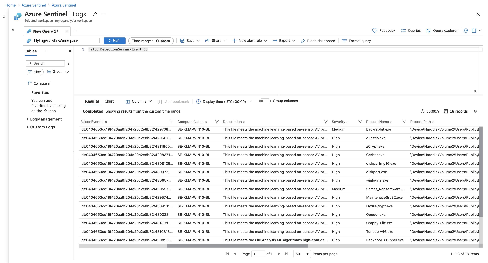

# Falcon Integration Gateway for Azure Log Analytics - Deployment Guide to AKS

This guide works through deployment of Falcon Integration Gateway for Azure Log Analytics to AKS. Only the Azure [backend](https://github.com/CrowdStrike/falcon-integration-gateway/tree/main/fig/backends) will be enabled by this guide.

### Prerequisites:

 - Have CrowdStrike CWP Subscription
 - Have Azure workloads registered with CrowdStrike Falcon platform.

### Step 1: Create new CrowdStrike API Key Pairs

Create new API key pair at [CrowdStrike Falcon](https://falcon.crowdstrike.com/support/api-clients-and-keys). This key pair will be used to read falcon events and supplementary information from CrowdStrike Falcon.

Make sure only the following permissions are assigned to the key pair:
 * Event streams: READ
 * Hosts: READ

### Step 2: Configure Azure and Log Analytics

Sign in to the Azure portal at [https://portal.azure.com/](https://portal.azure.com/)

1. Create a new resource group by selecting `Resource groups`.
1. Select `New`
1. Enter a new resource group name
1. Select `Review + Create`
1. Select `Create`

1. Create a new Log Analytics workspace by selecting `Log Analytics workspaces`. You might have to search for it as a resource if it is not in your home menu.
1. Select `New`
1. Select the resource group that was previously created and enter a name under `Instance details`
1. Select `Review + Create`
1. Select `Create`

Assign it to your resource group. (Home > Log Analytics workspaces > Create)

In your new workspace, navigate to "Agents management" in the settings section. Here you will find your Workspace ID and Primary key. Copy both of these values and use them to set up the FIG in the next step.

### Step 3: Edit kubernetes pod spec

Kubernetes pod specification file is readily available at [https://github.com/CrowdStrike/falcon-integration-gateway](falcon-integration-gateway.yaml).

```
wget https://raw.githubusercontent.com/crowdstrike/falcon-integration-gateway/main/docs/aks/falcon-integration-gateway.yaml
```

Replace the credentials in the pod spec with the actual Falcon and Azure credentials created in the previous steps. To following commands illustrate how to base64 encode the credentials.

```
echo -n $FALCON_CLIENT_ID | base64
```

```
echo -n $FALCON_CLIENT_SECRET | base64
```

```
echo -n $WORKSPACE_ID | base64
```

```
echo -n $PRIMARY_KEY | base64
```

### Step 4: Deploy to AKS

Ensure your kubectl command is configured to use AKS environment
```
kubectl cluster-info
```

Deploy the pod
```
kubectl apply -f falcon-integration-gateway.yaml
```

### Step 5: Verify the install

Navigate to Azure Sentinel Logs and search for `FalconDetection`.



Detail of Finding created.


