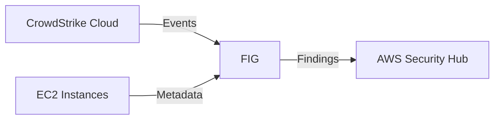

# AWS Security Hub Manual Deployment Guide

This guide will walk you through the steps to manually deploy the Falcon Integration Gateway on
an AWS EC2 instance as a Python application.

## Table of Contents

- [Prerequisites](#prerequisites)
- [Architecture Overview](#architecture-overview)
- [Deployment Steps](#deployment-steps)
  - [1. Create an Instance Profile](#1-create-an-instance-profile)
  - [2. Create an EC2 Instance (Linux)](#2-create-an-ec2-instance-linux)
  - [3. Deploy the FIG](#3-deploy-the-fig)
  - [4. Run the FIG](#4-run-the-fig)
  - [5. Verify in Security Hub](#5-verify-in-security-hub)
- [Troubleshooting](#troubleshooting)

## Prerequisites

- Falcon API Credentials with the following API scopes:
  - **Event streams**: [Read]
  - **Hosts**: [Read]
- Have appropriate AWS permissions to:
  - Create EC2 instances
  - Create IAM roles/policies
  - Access Security Hub

## Architecture Overview



> [!NOTE]
> Currently, this backend only supports sending detection events that originate from AWS to Security Hub.

## Deployment Steps

### 1. Create an Instance Profile

This will be used to grant the EC2 instance access to the Security Hub and EC2 API's.

> :exclamation: If you already have an instance profile that you would like to use, just ensure the role has the appropriate permissions and skip to step 2.

#### 1.1 Create a policy

1. Navigate to the [IAM Policies](https://console.aws.amazon.com/iam/home#/policies) page
1. Click the **Create policy** button
1. Select the **JSON** tab
1. Paste the following policy into the editor:

    ```json
    {
        "Version": "2012-10-17",
        "Statement": [
            {
                "Effect": "Allow",
                "Action": [
                    "ec2:DescribeInstances",
                    "ec2:DescribeRegions",
                    "securityhub:GetFindings"
                ],
                "Resource": "*"
            },
            {
                "Effect": "Allow",
                "Action": "securityhub:BatchImportFindings",
                "Resource": "arn:aws:securityhub:*:*:product/crowdstrike/crowdstrike-falcon"
            }
        ]
    }
    ```

1. Click the **Next** button
1. Give it a name (e.g. `FIG-SecurityHub-Access-Policy`) and click the **Create policy** button

#### 1.2 Create a role

1. Navigate to the [IAM Roles](https://console.aws.amazon.com/iam/home#/roles) page
1. Click the **Create role** button
1. Select **AWS service** as the trusted entity
1. Select **EC2** as the service/use-case that will use this role
1. Click the **Next** button
1. Search for the policy you created in the previous step (e.g. `FIG-SecurityHub-Access-Policy`) and select it
1. Click the **Next** button
1. Give it a name (e.g. `FIG-SecurityHub-Access-Role`) and click the **Create role** button

### 2. Create an EC2 Instance (Linux)

This step is completely up to you. You can use the AWS console, CLI, or any other method you prefer to create an EC2 instance. Just make sure you select the instance profile you created in the previous step
and that you have access to the instance via SSH.

For the purposes of this guide, we will be using the latest Amazon Linux 2023 AMI.

> If you have an existing instance that you would like to use, just ensure the instance has instance profile you created in the previous step and skip to step 3.

#### 2.1 Create an EC2 instance

1. Navigate to the [EC2 Instances](https://console.aws.amazon.com/ec2/v2/home#Instances) page
1. Click the **Launch Instance** button
   1. Fill out the instance details as you see fit
   1. Under **Advanced details**
      1. Select the instance profile you created in the previous step
1. Click the **Launch instance** button

### 3. Deploy the FIG

Connect to your EC2 instance via SSH and follow the steps below to install the FIG.

#### Installation Methods

| Method | Pros | Cons | Best For |
|--------|------|------|----------|
| Python Package | • Simple installation<br>• Automatic updates<br>• Dependency management | • Less customization | Most users |
| Git Repository | • Full source access<br>• Maximum customization<br>• Development features | • Manual updates<br>• Manual dependency management | Developers |

#### Choose Your Installation Method:

<details><summary>Python Package (<strong>Recommended</strong>)</summary>

#### 3.1 Ensure the following packages are installed

- Python 3.6 <= 3.11
- pip

```bash
sudo dnf install python3 python3-pip python3-devel
```

> Use the package manager for your distro to ensure these packages are installed.

#### 3.2 Install the FIG

Install the package:

```bash
python3 -m pip install 'falcon-integration-gateway>3.2.5'
```

#### 3.3 Configure the FIG

There are two different ways that you can configure the FIG to use the AWS backend.
You can either use the `config.ini` file or you can use environment variables.

> Refer to the [configuration options](../../../config/config.ini) available to the application
> and backend.

##### 3.3.1 Configure the FIG using the `config.ini` file

> [!NOTE]
> Instance existence confirmation can be disabled using the `confirm_instance` config.ini in
> the `[aws]` section or by setting the `AWS_CONFIRM_INSTANCE` environment variable. This option is
> available for scenarios where the account that is running the service application does not have
> access to the AWS account where the instance with the detection resides.

Create the `config.ini` file and set the following minimum values:

```ini
[main]
backends = AWS

[events]
severity_threshold = 3

[falcon]
cloud_region = <Falcon Cloud Region>
client_id = <Falcon Client ID>
client_secret = <Falcon Client Secret>
application_id = <EXAMPLE-SECHUB-APPID>

[aws]
region = <AWS Region>
```

##### 3.2.2 Configure the FIG using environment variables

Alternatively, if you would like to use environment variables, set the following minimum environment variables:

```bash
export FIG_BACKENDS=AWS
export EVENTS_SEVERITY_THRESHOLD=3
export FALCON_CLOUD_REGION=<Falcon Cloud Region>
export FALCON_CLIENT_ID=<Falcon Client ID>
export FALCON_CLIENT_SECRET=<Falcon Client Secret>
export FALCON_APPLICATION_ID=<EXAMPLE-SECHUB-APPID>
export AWS_REGION=<AWS Region>
```

</details>

<details><summary>Git Repository</summary>

#### 3.1 Ensure the following packages are installed

- Python 3.6+
- pip
- git

```bash
sudo dnf install python3 python3-pip python3-devel git
```

> Use the package manager for your distro to ensure these packages are installed.

#### 3.2 Install the FIG

1. Clone the repository

    ```bash
    git clone https://github.com/CrowdStrike/falcon-integration-gateway.git
    ```

1. Change to the FIG directory

    ```bash
    cd falcon-integration-gateway
    ```

1. Install the python dependencies.

    ```bash
    pip install -r requirements.txt
    ```

#### 3.3 Configure the FIG

There are two different ways that you can configure the FIG to use the AWS backend.
You can either use the `config/config.ini` file or you can use environment variables.

> Refer to the [configuration options](../../../config/config.ini) available to the application
> and backend.

##### 3.3.1 Configure the FIG using the `config/config.ini` file

> [!NOTE]
> Instance existence confirmation can be disabled using the `confirm_instance` config.ini in
> the `[aws]` section or by setting the `AWS_CONFIRM_INSTANCE` environment variable. This option is
> available for scenarios where the account that is running the service application does not have
> access to the AWS account where the instance with the detection resides.

1. Modify the `config/config.ini` file and set the following minimum values:

    ```ini
    [main]
    backends = AWS

    [events]
    severity_threshold = 3

    [falcon]
    cloud_region = <Falcon Cloud Region>
    client_id = <Falcon Client ID>
    client_secret = <Falcon Client Secret>
    application_id = <EXAMPLE-SECHUB-APPID>

    [aws]
    region = <AWS Region>
    ```

##### 3.3.2 Configure the FIG using environment variables

1. Set the following minimum environment variables:

    ```bash
    export FIG_BACKENDS=AWS
    export EVENTS_SEVERITY_THRESHOLD=3
    export FALCON_CLOUD_REGION=<Falcon Cloud Region>
    export FALCON_CLIENT_ID=<Falcon Client ID>
    export FALCON_CLIENT_SECRET=<Falcon Client Secret>
    export FALCON_APPLICATION_ID=<EXAMPLE-SECHUB-APPID>
    export AWS_REGION=<AWS Region>
    ```

</details>

### 4. Run the FIG

Run the following to start the FIG:

```bash
python3 -m fig
```

Verify output

```bash
2023-10-18 16:45:43 fig MainThread INFO     Starting Falcon Integration Gateway 3.2.1
2023-10-18 16:45:43 fig MainThread INFO     AWS Backend is enabled.
2023-10-18 16:45:43 fig MainThread INFO     Enabled backends will only process events with types: {'DetectionSummaryEvent'}
2023-10-18 16:45:44 fig cs_stream  INFO     Opening Streaming Connection
2023-10-18 16:45:44 fig cs_stream  INFO     Established Streaming Connection: 200 OK
...
...
```

### 5. Verify in Security Hub

As events are processed by the FIG, they will be sent to Security Hub. You can verify this by following the steps below.

1. Navigate to the [Security Hub](https://console.aws.amazon.com/securityhub/home) page
1. Click the **Findings** tab
1. Add a filter for **Product name** and enter **CrowdStrike Falcon**

---

## Troubleshooting

To get additional logging verbosity, you can set the logging level to `DEBUG` by modifying either the `config.ini` or setting an environment variable.

**Modify the `config.ini`:**

```ini
[logging]
level = DEBUG
```

**Alternatively, set the environment variable:**

```bash
export LOG_LEVEL=DEBUG
```
