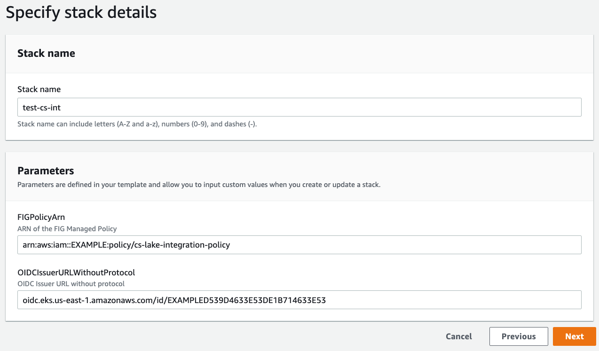

# CloudTrail Lake - Deployment to EKS
This guide offers 2 methods to deploy the Falcon Integration Gateway into an existing EKS Cluster. You
can choose to either deploy the FIG container with a Helm chart, or as a standard Kubernetes pod spec
file.

## Table of Contents
* [Prerequisites](#prerequisites)
  * [Create the IAM Role for the Service Account](#create-the-iam-role-for-the-service-account)
* [Choose Your Method](#choose-your-method)
  * [Deployment to EKS using Helm Chart](#deployment-to-eks-using-helm-chart)
  * [Deployment to EKS with Pod Spec](#deployment-to-eks-with-pod-spec)
* [Verify Deployment](#verify-deployment)

## Prerequisites
- Falcon API Credentials
- Your cluster has an OpenID Connect (OIDC) issuer URL associated with it.
  > This is necessary to properly create the IAM role for the service account used in the FIG. For
    more information, view the [AWS](https://docs.aws.amazon.com/eks/latest/userguide/iam-roles-for-service-accounts.html)
    documentation on this.

### Create the IAM Role for the Service Account
1. Please use the [CloudFormation Template](./assets/eks-role.yaml) to create your service account IAM Role.

    The screenshot below is an example.
    > Please note the `OIDCIssuerURLWithoutProtocol` does not have a protocol (http|s://).

    > The `FIGPolicyArn` is from the CloudTrail Lake Integration [Getting Started](https://github.com/CrowdStrike/Cloud-AWS/tree/main/cloudtrail-lake#getting-started) guide



2. Once the CloudFormation stack is completed, in the `Outputs` tab, make note of the `FalconFigAccessRoleArn` value.
    > This value will be used as an input when deploying the FIG application on EKS.

## Choose Your Method
### Deployment to EKS using Helm Chart
<details>
  <summary>Click to expand</summary>

  #### Prerequisite
  For Dependency requirements, installation instructions, as well as the full list of available configuration options, go to
  the [Helm Chart - Falcon Integration Gateway](https://github.com/CrowdStrike/falcon-helm/tree/main/helm-charts/falcon-integration-gateway)
  repository.

  ##### Export the following variables
  ```bash
  export FALCON_CLIENT_ID=<your api falcon client id>
  export FALCON_CLIENT_SECRET=<your api falcon client secret>
  export FALCON_CLOUD_REGION=<your api falcon client region>
  export CLOUDTRAIL_LAKE_CHANNEL_ARN=<your cloudtrail lake channel arn>
  export CLOUDTRAIL_LAKE_REGION=<your aws region aligning with channel>
  export FALCON_APPLICATION_ID=<your unique application stream identifier>
  export IAM_ROLE_ARN=<value from FalconFigAccessRoleArn stack output>
  ```

  #### Installation
  1. Add the CrowdStrike Falcon Helm repository
      ```bash
      helm repo add crowdstrike https://crowdstrike.github.io/falcon-helm
      ```
  2. Update the local Helm repository cache
      ```bash
      helm repo update
      ```
  3. Install the FIG with AWS CloudTrail Lake enabled:
      ```bash
      helm install falcon-fig crowdstrike/falcon-integration-gateway -n falcon-integration-gateway --create-namespace \
        --set falcon.client_id=$FALCON_CLIENT_ID \
        --set falcon.client_secret=$FALCON_CLIENT_SECRET \
        --set falcon.cloud_region=$FALCON_CLOUD_REGION \
        --set falcon.integration_gateway.application_id=$FALCON_APPLICATION_ID \
        --set push.cloudtrail_lake.enabled=true \
        --set push.cloudtrail_lake.channel_arn=$CLOUDTRAIL_LAKE_CHANNEL_ARN \
        --set push.cloudtrail_lake.region=$CLOUDTRAIL_LAKE_REGION \
        --set serviceAccount.annotations."eks\.amazonaws\.com/role-arn"=$IAM_ROLE_ARN
      ```

  #### Uninstall Helm Chart
  To uninstall, run the following command:
  ```bash
  helm uninstall falcon-fig -n falcon-integration-gateway
  ```
  You may need/want to delete the falcon-integration-gateway namespace as well since helm will not do it for you:
  ```bash
  kubectl delete ns falcon-integration-gateway
  ```
</details>

### Deployment to EKS with Pod Spec
<details>
  <summary>Click to expand</summary>

  #### Step 1: Edit Kubernetes Pod Spec
  Download/Edit the pod specification file available [here](https://github.com/CrowdStrike/falcon-integration-gateway/blob/main/docs/cloudtrail-lake/eks/falcon-integration-gateway.yaml).
  ```bash
  wget https://raw.githubusercontent.com/crowdstrike/falcon-integration-gateway/main/docs/cloudtrail-lake/eks/falcon-integration-gateway.yaml
  ```
  Replace the credentials in the pod spec with the actual Falcon API credentials. The following commands illustrate how to base64 encode the credentials.
  ```bash
  echo -n $FALCON_CLIENT_ID | base64
  ```
  ```bash
  echo -n $FALCON_CLIENT_SECRET | base64
  ```
  Replace the `<IAM_ROLE_ARN>` variable with the `FalconFigAccessRoleArn` output value from the cloudformation SA IAM role stack.
  ```yaml
  apiVersion: v1
  kind: ServiceAccount
  metadata:
  name: falcon-integration-gateway
  namespace: falcon-integration-gateway
  annotations:
    eks.amazonaws.com/role-arn: <IAM_ROLE_ARN>
  ```
  ##### ConfigMap Updates:
  Uncomment the following variables in the `config.ini` ConfigMap:
  > For more information about configuration options, refer to the FIG [config.ini](../../../config/config.ini).

  `channel_arn =` should be set to your provided CloudTrail Lake Channel ARN

  `region =` should be set to your AWS region where you setup the CloudTrail Lake Channel

  `application_id =` should be set to something unique.
  > :exclamation: Running multiple FIG instances with the same `application_id` can cause issues.

  See the below example of config changes:
  <details open>
    <summary>Example config.ini</summary>

  ```bash
  # Falcon Integration Gateway

  [main]
  # Cloud backends that are enabled. The gateway will push events to the cloud providers specified below
  backends=CLOUDTRAIL_LAKE

  # Uncomment to configure number of threads that process Falcon Events
  #worker_threads = 4

  [events]
  # Uncomment to filter out events based on number of days past the event (default 21)
  older_than_days_threshold = 14

  [logging]
  # Uncomment to request logging level (ERROR, WARN, INFO, DEBUG)
  #level = DEBUG

  [falcon]
  # Uncomment to provide Falcon Cloud. Alternatively, use FALCON_CLOUD_REGION env variable.
  cloud_region = us-2

  # Uncomment to provide application id. Needs to be different per each fig instance.
  # Alternatively, use FALCON_APPLICATION_ID env variable.
  application_id = fig-int-1

  [cloudtrail_lake]
  # AWS CloudTrail Lake section is applicable only when CLOUDTRAIL_LAKE backend is enabled in the [main] section.

  # Uncomment to provide the Channel ARN. Alternatively, use CLOUDTRAIL_LAKE_CHANNEL_ARN env variable.
  channel_arn = arn:aws:cloudtrail:us-east-1:EXAMPLE:channel/EXAMPLE-9f94-471c-96ba-EXAMPLE

  # Uncomment to provide the AWS region. Should match the same region as the Channel.
  # Alternatively, use CLOUDTRAIL_LAKE_REGION env variable.
  region = us-east-1
  ```
  </details>

  #### Step 2: Deploy to EKS
  Ensure your kubectl command is configured to use your EKS environment
  ```bash
  kubectl cluster-info
  ```
  Deploy the pod
  ```bash
  kubectl apply -f falcon-integration-gateway.yaml
  ```
  A successful run should display:
  ```bash
  namespace/falcon-integration-gateway created
  secret/falcon-integration-gateway-creds created
  configmap/falcon-integration-gateway-config created
  serviceaccount/falcon-integration-gateway created
  deployment.apps/falcon-integration-gateway created
  ```

  ### Uninstall
  To uninstall, run the following command:
  ```bash
  kubectl delete -f falcon-integration-gateway.yaml
  ```
</details>

## Verify Deployment
Run the following commands to verify deployment was successful.

To verify pod health and get the pod name:
```bash
kubectl get pods -n falcon-integration-gateway
```
View the pod logs:
```bash
kubectl logs -n falcon-integration-gateway <pod name>
```
A successful deployment should have logs that start with:
```bash
2022-09-15 19:52:35 fig MainThread INFO     AWS CloudTrail Lake Backend is enabled.
2022-09-15 19:52:36 fig cs_stream  INFO     Opening Streaming Connection
...
...
```
