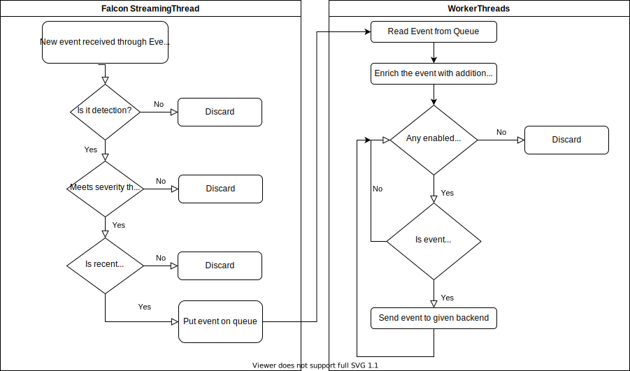

# Developer Guide

To understand the architecture, readers are advised to review [./fig/__main__.py](../fig/__main__.py). Central to the application is the event queue with one writer to the queue (Falcon module) and multiple readers from the queue (the worker threads). Falcon module maintains streaming session to CrowdStrike Falcon cloud and translates events from the streaming session to the internal queue. Once an event is put on queue it awaits its pickup by one of the worker threads. Worker thread iterates through enabled [backends](../fig/backends) and asks relevant backends to process the event.

The following figure illustrates the event flow through the application.

