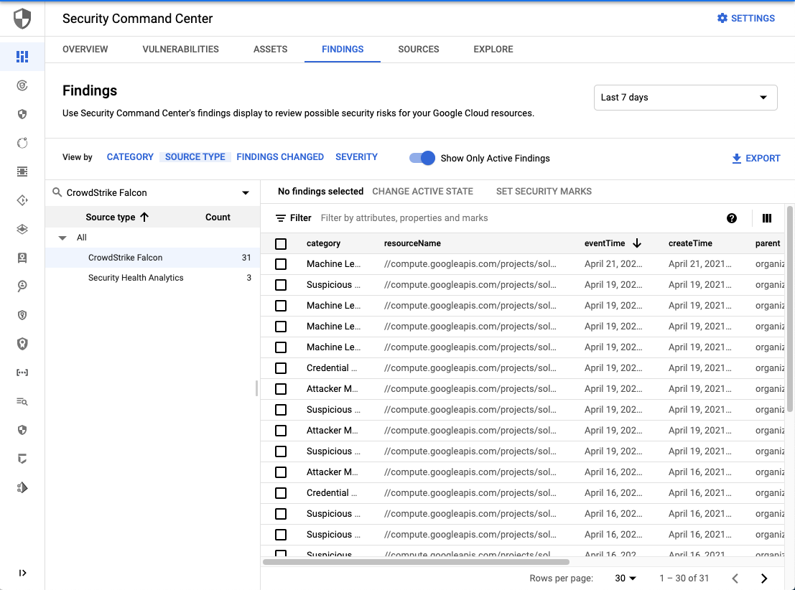
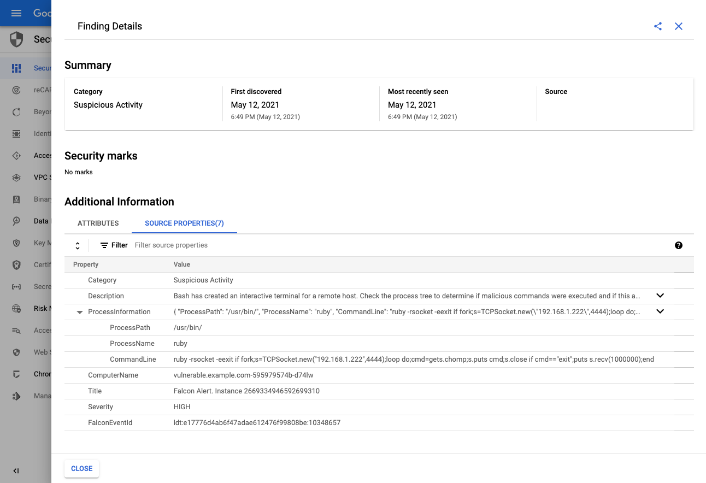

# Falcon Integration Gateway for SCC - Deployment Guide to GKE

This guide works through deployment of Falcon Integration Gateway for SCC to GKE. Only the GCP [backend](https://github.com/CrowdStrike/falcon-integration-gateway/tree/main/fig/backends) will be enabled by this guide.

### Prerequisites:

 - Have CrowdStrike CWP Subscription
 - Have Security Command Center enabled in google cloud.
 - Have GCP workloads registered with CrowdStrike Falcon platform.
 - Have `gcloud` tool installed locally or use [cloud-tools-image](https://github.com/CrowdStrike/cloud-tools-image)

### Step 1: Create new CrowdStrike API Key Pairs

Create new API key pair at [CrowdStrike Falcon](https://falcon.crowdstrike.com/support/api-clients-and-keys). This key pair will be used to read falcon events and supplementary information from CrowdStrike Falcon.

Make sure only the following permissions are assigned to the key pair:
 * **Event streams**: READ
 * **Hosts**: READ

### Step 2: Create new GCP Service Account

This service account will be used to create Falcon Findings in GCP Security Command Center. [GCP Documentation](https://cloud.google.com/security-command-center/docs/how-to-programmatic-access) can be consulted to set-up programmatic access to Security Command Center.

```
export PROJECT_ID=$(gcloud config get-value project)
export PROJECT_NUMBER=$(gcloud projects list --filter="$PROJECT" --format="value(PROJECT_NUMBER)")
export ORG_ID="$(gcloud projects get-ancestors $PROJECT_ID | grep organization | cut -f1 -d' ')"
export SERVICE_ACCOUNT=falcon-integration-gateway
export KEY_LOCATION="./gcloud-secret-${SERVICE_ACCOUNT}.json"


# Create service account for this project
gcloud iam service-accounts create $SERVICE_ACCOUNT  --display-name \
 "Service Account for falcon-integration-gateway"  --project $PROJECT_ID

# Create key for the service account
gcloud iam service-accounts keys create $KEY_LOCATION  --iam-account \
 $SERVICE_ACCOUNT@$PROJECT_ID.iam.gserviceaccount.com

# Grant the service account the securitycenter.admin role for the organization.
gcloud organizations add-iam-policy-binding $ORG_ID \
  --member="serviceAccount:$SERVICE_ACCOUNT@$PROJECT_ID.iam.gserviceaccount.com" \
  --role='roles/securitycenter.admin'
```

### Step 3: Enable security Command Center API in your projects

If your project has never had API for SCC enabled, chances are you will have to visit the following URL and enable API manually. https://console.cloud.google.com/apis/library/securitycenter.googleapis.com

### Step 4: Edit kubernetes pod spec

Kubernetes pod specification file is readily available at [https://github.com/CrowdStrike/falcon-integration-gateway](falcon-integration-gateway.yaml).

```
wget https://raw.githubusercontent.com/crowdstrike/falcon-integration-gateway/main/docs/gke/falcon-integration-gateway.yaml
```

Replace the credentials in the pod spec with the actual Falcon and GCP credentials created in the previous steps. To following commands illustrate how to base64 encode the credentials.

```
echo -n $FALCON_CLIENT_ID | base64
```

```
echo -n $FALCON_CLIENT_SECRET | base64
```

```
base64 $KEY_LOCATION
```

### Step 5: Deploy to GKE

Ensure your kubectl command is configured to use GKE environment
```
kubectl cluster-info || gcloud container clusters get-credentials MY_CLUSTER_NAME
```

Deploy the pod
```
kubectl apply -f falcon-integration-gateway.yaml
```

### Step 6: Verify the install

Navigate to [GCP Security Command Center](https://console.cloud.google.com/security/command-center/findings) to confirm that new **Findings Source** called **CrowdStrike Falcon** has appeared.



Detail of Finding created.



### Appendix A: Re-using single Falcon Integration Gateway for multiple GCP Organizations/Projects

Falcon Integration Gateway is able to automatically discover GCP projects and organizations it has access to. The access permissions are determined from the service account created in the *Step 2: Create new GCP Service Account* of this guide.

To enable multi-org access, please create service account in one of your organizations and grant **roles/securitycenter.admin** permission to this service account in every organization that it should manage.

### Appendix B: Per-project level permissions on GCP side

Falcon Integration Gateway needs to be granted `securitycenter.admin` role on the organization level, meaning that the access to Google Security Command Center (SCC) cannot be restricted per GCP project or GCP folder. This is caused by the access model of SCC and is outside of scope of this project. Please refer to the following excerpt of [GCP SCC FAQ](https://cloud.google.com/security-command-center/docs/faq):

> Can I limit who views which projects?
> Currently, permissions for Security Command Center are at the organization level. Folder and project level permissions will be added in a future release. For more information, see [Access control](https://cloud.google.com/security-command-center/docs/access-control).
