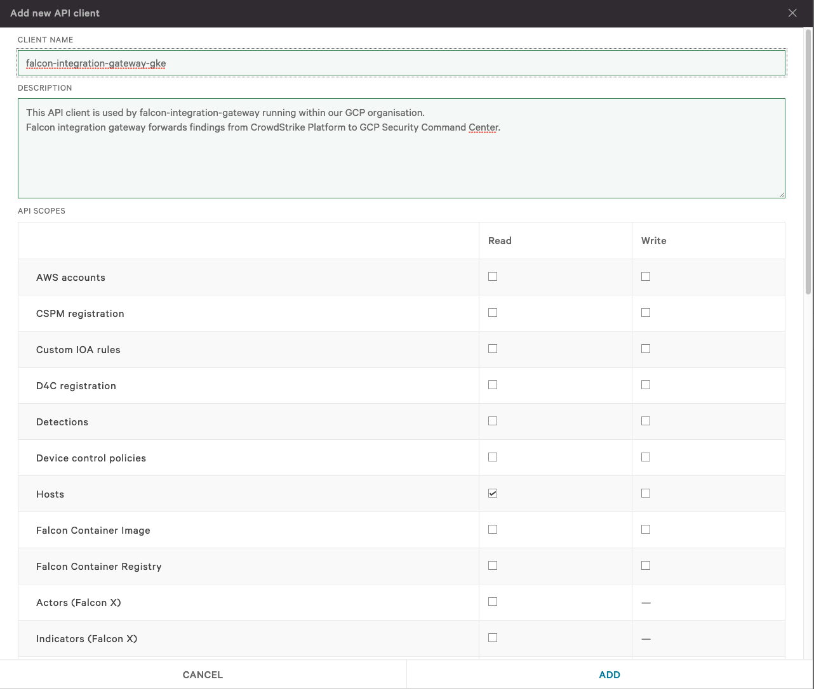
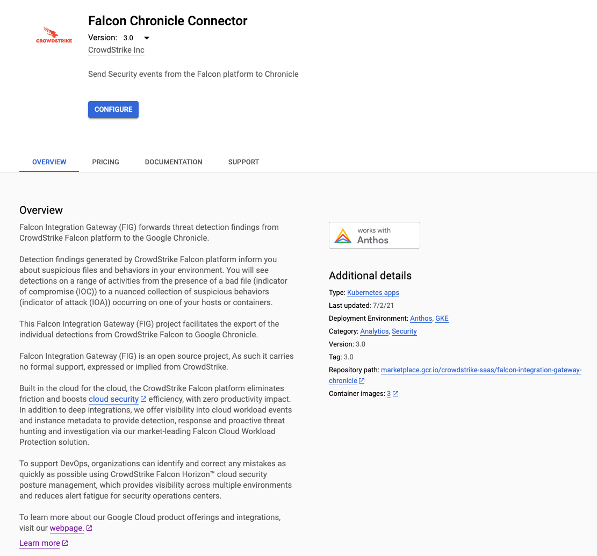
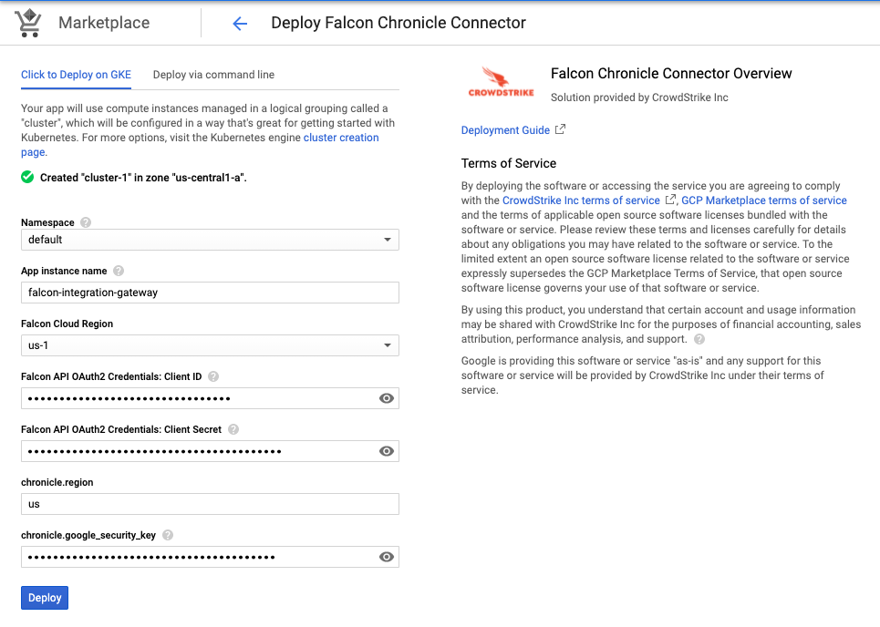
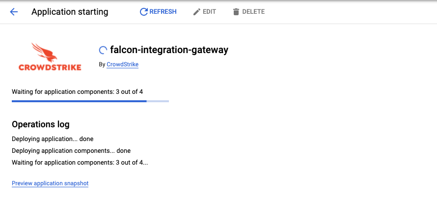
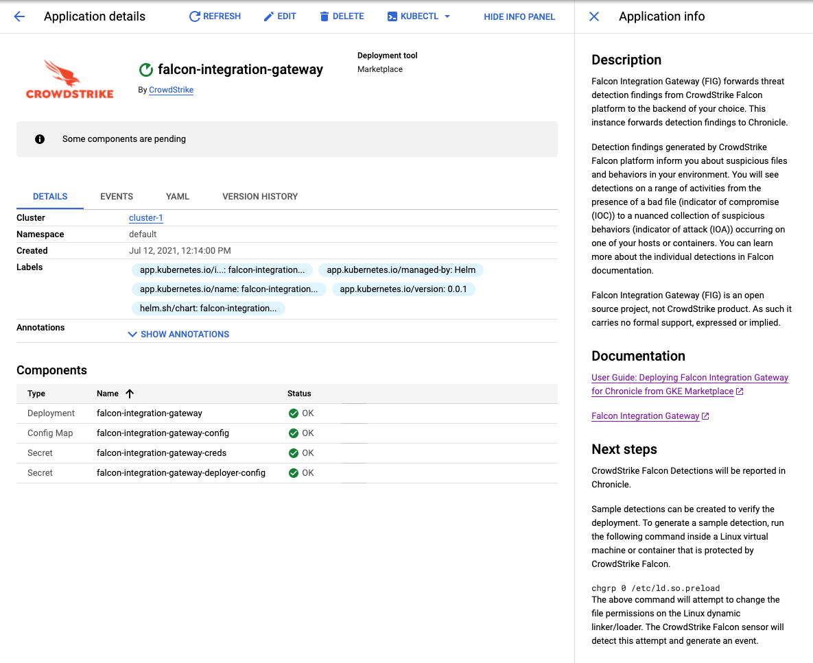

# User Guide for deploying Falcon Integration Gateway for Chronicle from GKE Marketplace

### Prerequisites:

 - Have CrowdStrike CWP Subscription
 - Have Chronicle Subscription

### Step 1: Obtain OAuth2 API credentials for CrowdStrike Falcon

 - Navigate to [API Clients and Keys](https://falcon.crowdstrike.com/support/api-clients-and-keys) within CrowdStrike Falcon platform.
 - Use Add new API client* button in the top right corner to create a new key pair
 - Make sure only the following permissions are assigned to the key pair:
  - Event streams: READ
  - Hosts: READ
 

 
### Step 2: Obtain Chroncile Service Account file & Customer ID.

Your Chronicle support representative can provide this file.

### Step 3: Navigate to Falcon Integration Gateway Listing Page

[Marketplace Link](https://console.cloud.google.com/marketplace/product/crowdstrike-saas/falcon-integration-gateway-chronicle)

### Step 4: Configure the application

Configure button leads you to application configuration page.
 - Fill in Falcon OAuth2 API credentials obtained in Step 1 of this guide.
 - Fill in Chronicle Customer ID and Chronicle Region

### Step 5: Hit deploy button

