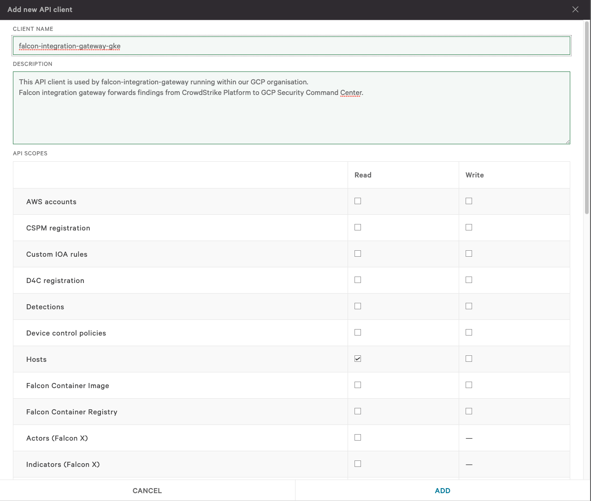
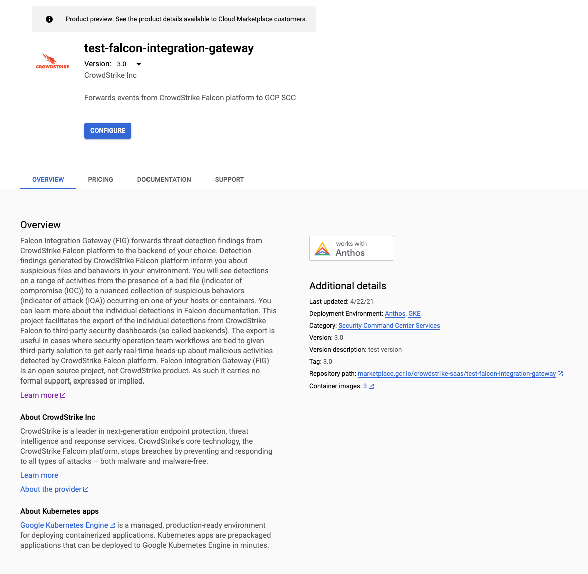
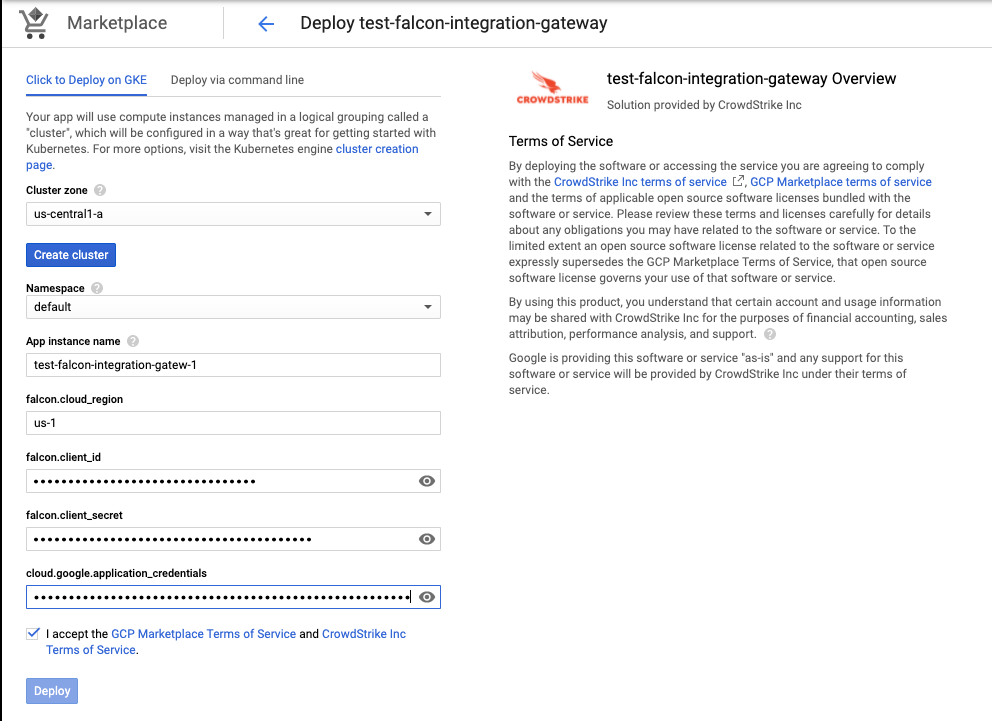
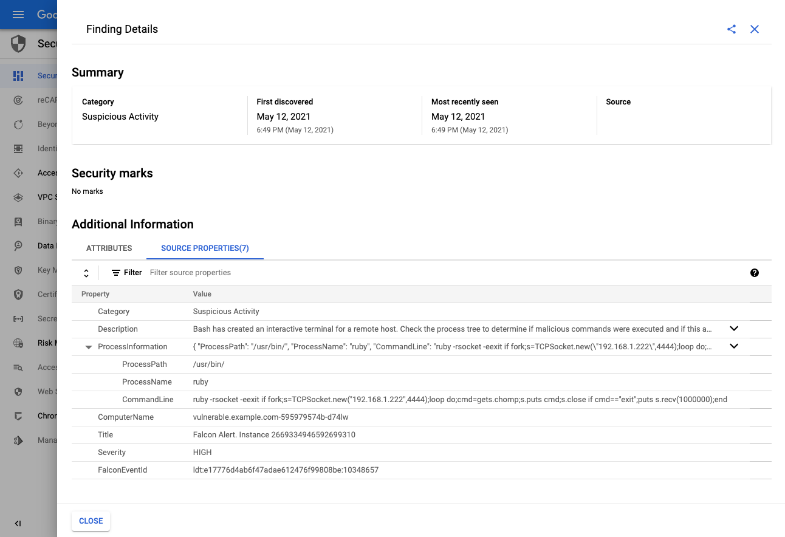

# User Guide for deploying Falcon Integration Gateway from GKE Marketplace

### Prerequisites:

 - Have CrowdStrike CWP Subscription
 - Have Security Command Center enabled in google cloud.
 - Have GCP workloads registered with CrowdStrike Falcon platform.

### Step 1: Obtain OAuth2 API credentials for CrowdStrike Falcon

 - Navigate to [API Clients and Keys](https://falcon.crowdstrike.com/support/api-clients-and-keys) within CrowdStrike Falcon platform.
 - Use *Add new API client* button in the top right corner to create a new key pair
 - Make sure only the following permissions are assigned to the key pair:
   - **Event streams**: READ
   - **Hosts**: READ
 

 
### Step 2: Create GCP Service Account for managing SCC findings

This service account will be used to create Falcon Findings in GCP Security Command Center. [GCP Documentation](https://cloud.google.com/security-command-center/docs/how-to-programmatic-access) can be consulted to set-up programmatic access to Security Command Center.

Command-line instructions
```
export PROJECT_ID=$(gcloud config get-value project)
export PROJECT_NUMBER=$(gcloud projects list --filter="$PROJECT" --format="value(PROJECT_NUMBER)")
export ORG_ID="$(gcloud projects get-ancestors $PROJECT_ID | grep organization | cut -f1 -d' ')"
export SERVICE_ACCOUNT=falcon-integration-gateway
export KEY_LOCATION="./gcloud-secret-${SERVICE_ACCOUNT}.json"


# Create service account for this project
gcloud iam service-accounts create $SERVICE_ACCOUNT  --display-name \
 "Service Account for falcon-integration-gateway"  --project $PROJECT_ID

# Create key for the service account
gcloud iam service-accounts keys create $KEY_LOCATION  --iam-account \
 $SERVICE_ACCOUNT@$PROJECT_ID.iam.gserviceaccount.com

# Grant the service account the securitycenter.admin role for the organization.
gcloud organizations add-iam-policy-binding $ORG_ID \
  --member="serviceAccount:$SERVICE_ACCOUNT@$PROJECT_ID.iam.gserviceaccount.com" \
  --role='roles/securitycenter.admin'

# Encode credentials for passing them to Falcon Integration Gateway
base64 $KEY_LOCATION
```

### Step 3: Navigate to Falcon Integration Gateway Listing Page

[Marketplace Link](https://console.cloud.google.com/marketplace/product/crowdstrike-saas/falcon-integration-gateway-scc)



### Step 4: Configure the application

Configure button leads you to application configuration page.
 - Fill in Falcon OAuth2 API credentials obtained in Step 1 of this guide.
 - Fill in base64 encoded GCP service account credentials



### Step 5: Hit deploy button

### Step 6: Verify the install

Navigate to [GCP Security Command Center](https://console.cloud.google.com/security/command-center/findings) to confirm that new **Findings Source** called **CrowdStrike Falcon** has appeared.


Detail of Finding created.


